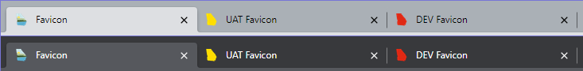

# Georgia EPD-IT Logos and Icons

Branding files for use by Georgia EPD.

## EPD logo

The new EPD logo and icon are available in SVG and PNG formats.


## Seal of Georgia 

Available in flat color (vector and bitmapped) and  gold (bitmapped only). The vector file originally came from [Wikimedia Commons](https://commons.wikimedia.org/wiki/File:Seal_of_Georgia.svg), which work was released into the public domain by the original author.


## Favicons

To set the shortcut icon for a website, copy the assets in the `favicon/` folder (not counting the "head-snippet.html" file) into the root of your application. Then copy the following lines into the `<head>` section of your HTML document:

```html
  <link rel="icon" href="/favicon.ico" sizes="any">
  <link rel="icon" href="/icon.svg" type="image/svg+xml">
  <link rel="apple-touch-icon" href="/apple-touch-icon.png">
  <link rel="manifest" href="/manifest.webmanifest">
  <meta name="theme-color" content="#e5f6fa">
```

### DEV/UAT Favicons

To optionally enable alternate favicons for DEV/UAT environments, copy the additional icons from the `favicon-alt/` folder into the application root and add the following lines (or their equivalent) to the document `<head>`:

```html
  <environment include="Development">
    <link rel="icon" href="/icon-dev.svg" type="image/svg+xml">
  </environment>
  <environment include="Staging">
    <link rel="icon" href="/icon-uat.svg" type="image/svg+xml">
  </environment>
```


